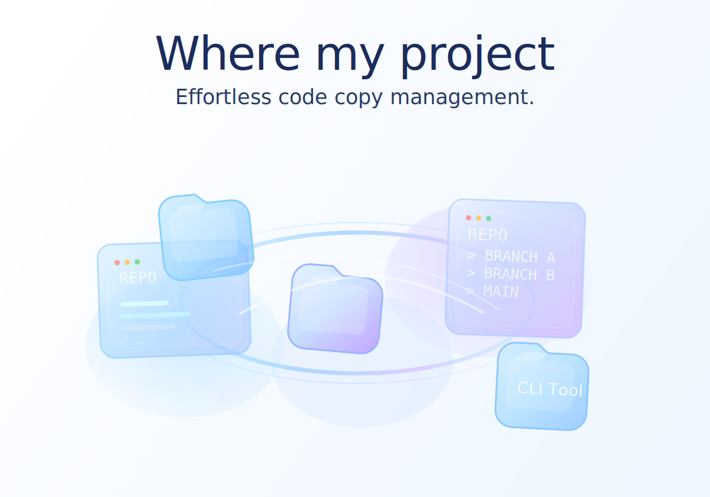

# Where My Project

<p align="center">
  
</p>

<p align="center">
  A PowerShell-friendly Rust CLI/TUI for tracking, checking, and jumping between multiple local clones of the same Git repository.
</p>

<p align="center">
  <a href="https://github.com/c0sc0s/where-my-project/actions/workflows/ci.yml"></a>
  <a href="https://github.com/c0sc0s/where-my-project/releases"></a>
  <a href="./LICENSE"></a>
</p>

<p align="center">
  <a href="#简体中文">简体中文</a> · <a href="#english">English</a>
</p>

## 简体中文

### 项目简介

`proj` 是一个面向 Windows / PowerShell 的 Rust CLI/TUI，用来管理同一 Git 仓库的多个本地副本。

它解决的典型问题是：

- 同一个仓库在本地有多份 clone，分别跑不同分支、不同实验或不同客户环境
- 过一段时间后，已经忘了哪一份在什么目录、当前在哪个分支、是否有未提交修改
- 想快速打开一个交互式列表，选中目标后直接跳过去继续工作

`proj` 会扫描你的目录、把结果保存到 `~/.proj.json`，并提供状态查看、TUI 选择器、PowerShell 快速跳转等能力。

### 适用场景

- 同时维护 `main`、feature、hotfix 等多个工作副本
- 为不同客户、环境或实验保留独立代码目录
- 想批量查看哪些副本是干净的，哪些副本有改动
- 想用更轻量的方式替代手动记录目录路径

### 核心功能

- `proj scan <path...>`：扫描指定目录，并记住这些扫描根目录
- `proj scan <keyword>`：在已记住目录、当前 `workspace`、本机盘符等位置搜索匹配仓库
- `proj` 或 `proj list`：打开交互式项目列表
- `proj status [target]`：查看全部项目或某一个项目的 Git 状态
- `proj cd <target> --raw`：输出原始路径，方便 shell 集成
- `proj init`：生成 `pcd` / `pl` 等 PowerShell 集成函数
- `proj work <target>`：输出工作目录路径，适合给脚本或外部包装命令使用

### 安装

当前官方 Release 产物面向 Windows x86_64，默认集成方式也以 PowerShell 为主。

一键安装或升级：

```powershell
irm https://raw.githubusercontent.com/c0sc0s/where-my-project/main/install.ps1 | iex
Install-Proj -Repo "c0sc0s/where-my-project"
```

重复执行同样的命令即可升级到最新 GitHub Release。

卸载：

```powershell
irm https://raw.githubusercontent.com/c0sc0s/where-my-project/main/install.ps1 | iex
Uninstall-Proj
```

手动安装也可以直接下载 Release 中的 `proj-windows-x86_64.zip`，将 `proj.exe` 放到你自己的 `PATH` 目录里，然后执行：

```powershell
proj init | Out-String | Invoke-Expression
```

### 快速开始

先扫描你的代码目录：

```powershell
proj scan D:\code C:\work
```

如果你已经记住过扫描根目录，也可以按仓库名关键词搜索：

```powershell
proj scan my-repo
```

打开交互式列表：

```powershell
proj
```

安装 PowerShell 集成后，可以直接跳转：

```powershell
pcd my-repo
pcd 1
pl
```

查看状态：

```powershell
proj status
proj status my-repo
```

### 命令一览

| 命令 | 说明 |
| --- | --- |
| `proj` | 打开交互式项目列表 |
| `proj list` | 显式打开交互式列表 |
| `proj scan <path...>` | 扫描目录并更新本地记录 |
| `proj scan <keyword>` | 按关键词搜索仓库 |
| `proj status` | 查看所有已记录项目状态 |
| `proj status <target>` | 查看单个项目状态 |
| `proj cd <target>` | 输出 `Set-Location ...` 命令 |
| `proj cd <target> --raw` | 仅输出原始路径 |
| `proj work <target>` | 输出工作目录路径，并附带友好提示 |
| `proj init` | 输出 PowerShell 集成脚本 |

`target` 支持三种形式：

- 仓库名：如 `my-repo`
- 索引：如 `1`
- 完整路径：如 `C:\work\my-repo`

### 从源码构建

```powershell
cd proj
cargo build --release
```

生成的二进制位于：

`proj/target/release/proj.exe`

### 发布

仓库已经包含基础 CI / Release 工作流：

- Push 到 `main` 或发起 Pull Request 时会运行 Windows 构建
- Push 标签 `vX.Y.Z` 时会生成 GitHub Release
- 版本号以 `proj/Cargo.toml` 为准，发版前先更新这里

发版示例：

```powershell
git tag v0.2.6
git push origin v0.2.6
```

### 开源信息

- 开源协议：`MIT`，见 `LICENSE`
- 贡献说明：见 `CONTRIBUTING.md`
- 行为准则：见 `CODE_OF_CONDUCT.md`
- 欢迎提 Issue 和 Pull Request
- 如果变更了命令行为、安装方式或对外文档，请一并更新 README

## English

### Overview

`proj` is a small Rust CLI/TUI for managing multiple local clones of the same Git repository, with a workflow designed around Windows and PowerShell.

It is useful when you:

- keep several local copies of one repo for different branches, experiments, or client environments
- forget which clone lives where and what state it is in
- want a fast interactive picker to jump back into the right working copy

`proj` scans your folders, stores the discovered entries in `~/.proj.json`, and gives you a lightweight way to inspect status, browse clones, and jump into the one you need.

### What It Does Well

- Track many local copies of the same repository
- Show branch and dirty/clean status across tracked clones
- Open an interactive TUI list instead of searching manually
- Jump to a target clone by repo name, index, or full path
- Generate PowerShell aliases and helper functions for daily use

### Features

- `proj scan <path...>`: scan explicit directories and remember them as scan roots
- `proj scan <keyword>`: search remembered roots, workspace-style folders, and local drives for matching repositories
- `proj` or `proj list`: open the interactive picker
- `proj status [target]`: inspect one clone or every tracked clone
- `proj cd <target> --raw`: print the raw path for shell integration
- `proj init`: print PowerShell helper functions such as `pcd` and `pl`
- `proj work <target>`: print the resolved working path for scripts or wrappers

### Install

The official release bundle currently targets Windows x86_64, and the default shell integration is PowerShell-first.

Install or upgrade:

```powershell
irm https://raw.githubusercontent.com/c0sc0s/where-my-project/main/install.ps1 | iex
Install-Proj -Repo "c0sc0s/where-my-project"
```

Run the same commands again later to upgrade to the newest GitHub Release.

Uninstall:

```powershell
irm https://raw.githubusercontent.com/c0sc0s/where-my-project/main/install.ps1 | iex
Uninstall-Proj
```

If you prefer a manual install, download `proj-windows-x86_64.zip` from GitHub Releases, place `proj.exe` somewhere on your `PATH`, then load the shell helpers:

```powershell
proj init | Out-String | Invoke-Expression
```

### Quick Start

Scan one or more code directories:

```powershell
proj scan D:\code C:\work
```

Search by repository name after you already have remembered roots:

```powershell
proj scan my-repo
```

Open the interactive picker:

```powershell
proj
```

Jump directly after loading the PowerShell integration:

```powershell
pcd my-repo
pcd 1
pl
```

Check repository state:

```powershell
proj status
proj status my-repo
```

### Command Reference

| Command | Description |
| --- | --- |
| `proj` | Open the interactive project picker |
| `proj list` | Explicitly open the interactive picker |
| `proj scan <path...>` | Scan directories and refresh stored entries |
| `proj scan <keyword>` | Search repositories by keyword |
| `proj status` | Show status for all tracked projects |
| `proj status <target>` | Show status for one project |
| `proj cd <target>` | Print a `Set-Location ...` command |
| `proj cd <target> --raw` | Print only the raw path |
| `proj work <target>` | Print the working path with a friendly hint |
| `proj init` | Print the PowerShell integration script |

`target` can be:

- a repository name, such as `my-repo`
- an index, such as `1`
- a full path, such as `C:\work\my-repo`

### Build From Source

```powershell
cd proj
cargo build --release
```

The binary will be created at:

`proj/target/release/proj.exe`

### Release Flow

The repository already includes lightweight CI and release automation:

- pushes to `main` and pull requests trigger a Windows build
- tags like `vX.Y.Z` trigger a GitHub Release
- the source of truth for versioning is `proj/Cargo.toml`

Example:

```powershell
git tag v0.2.6
git push origin v0.2.6
```

### Open Source Notes

- License: `MIT`, see `LICENSE`
- Contribution guide: see `CONTRIBUTING.md`
- Code of conduct: see `CODE_OF_CONDUCT.md`
- Issues and pull requests are welcome
- Please update docs when you change user-facing commands, installation, or release behavior
